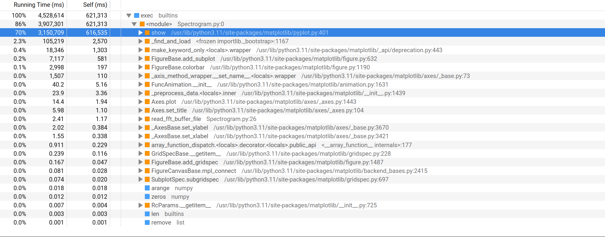
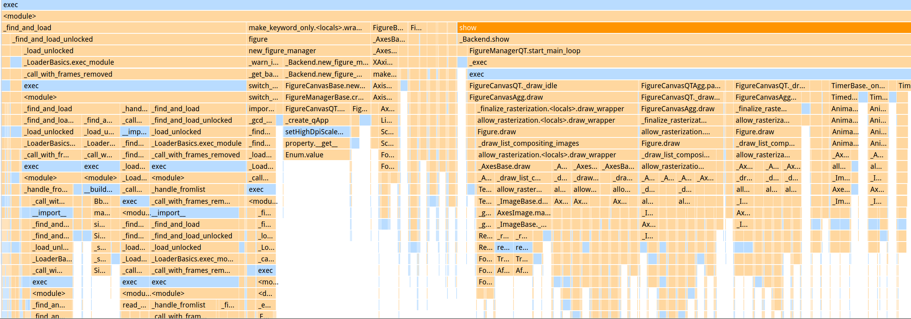
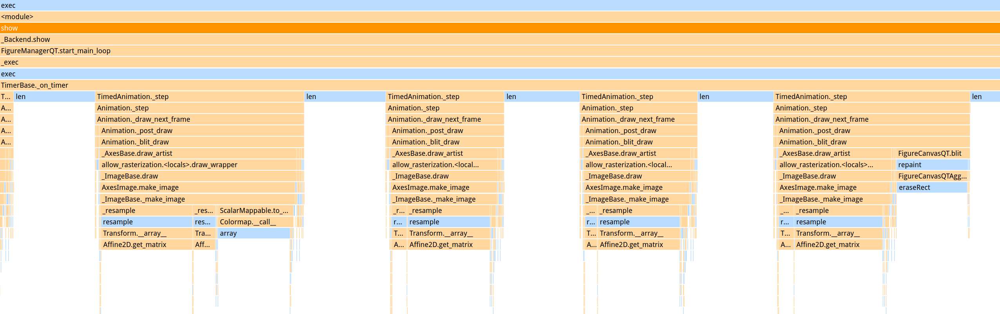

# Timing
## Profiling
The python profiler used was [functiontrace](https://functiontrace.com/), with the simple command 

`cpulimit -l 24 functiontrace Spectrogram.py`

This command uses cpulimit to restrict the functiontrace operation to 24% of my laptop's CPU speed, which is 3.4Ghz. This roughly accounts for the difference between my laptop's dual core processor, and the DE-10 nano's dual core 800Mhz processor.

Noteworthy in the profile is that 70% of the clock cycles are spent on show(), which means that only 30% is available for optimization. Further improvements to the code will only yield marginal performance improvements without changing how the plots are displayed. This was calculated with a profile of over 10 minutes of runtime, which minimizes the effects of startup transients.

Below is the stack chart from the initialization of the software, which shows that the initialization is mostly find_and_load, and the first few draws are slower than the rest.

The runtime stack chart, below, shows an assortment of four typical frames, with no user input, after the end of the initialization transient. 

---
## Time measurements
Using the same cpulimit factor to approximate the performance of the DE-10 Nano, we add a `print(time.time_ns()/1000000)` line in the `update_spectrogram()` function.

This gives us an average framerate of just over 10 FPS. This misses our spec by a third, and the degree to which it misses our spec is not solvable with optimizations short of switching from matplotlib.

---
## ARM Performance Adjustment
[Phoronix](https://www.phoronix.com/review/gentoo_arm_x32/2) released comparisons of the ARM Cortex A9 and an x86 processor. Performance on dcraw shows nearly identical performance between the Cortex A9 and the x86-64 processor at the same clock speed.

This data suggests that once adjusted for clock speed, we should see similar performance between the laptop and the DE-10 Nano SOC.

